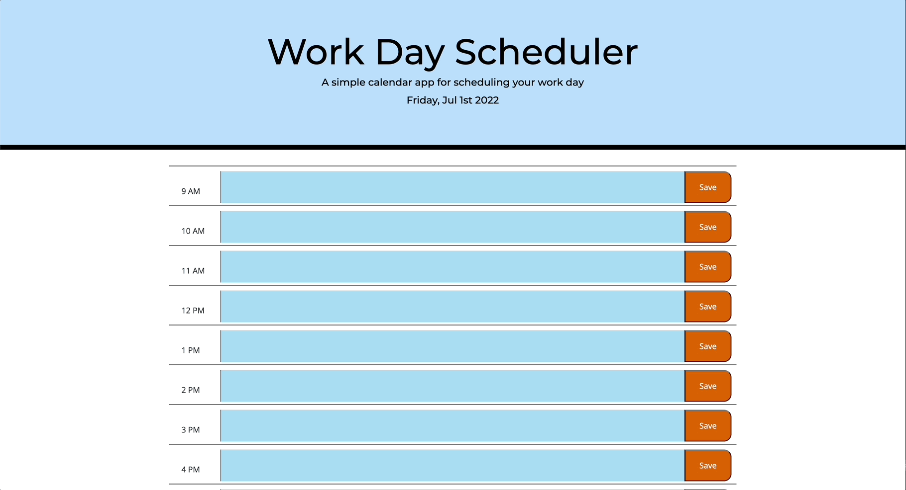

# Work Day Scheduler

## Project Summary

The following project entailed creating a [Work Day Scheduler](https://lilyannekot.github.io/work-day-scheduler/) containing individual time slots for each hour of the day from 9am-5pm. When you click on the text box in each time slot, you are able to add events you have throughout the day and save them to the page.

## Languages and Technology Used

* HTML
* CSS
* JavaScript
* Git

## Project Demonstration



## Code Snippet

The code presented below is used to change the background color of the time slots depending on what time it is. The current time slot will be set to yellow, past time slots will be light blue, and future time slots will be pink.

```
function plannerColors() {
    var currentTime = moment().hours();

$(".time-block").each(function() {
        var blockTime = parseInt($(this).data('time'));
        console.log(blockTime)

        if (blockTime < currentTime) {
            $(this).addClass('past');
        } else if (blockTime === currentTime) {
            $(this).addClass('present');
        } else {
            $(this).addClass('future');
        }
    })
```

## Author Links

* [GitHub](https://github.com/lilyannekot)
* [Project Website](https://lilyannekot.github.io/work-day-scheduler/)
* [LinkedIn](https://www.linkedin.com/in/lilykot/)